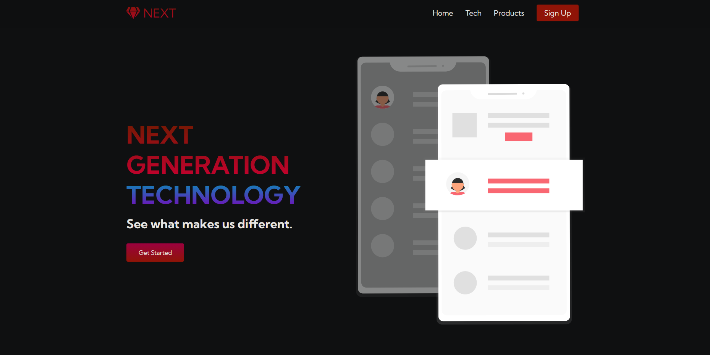

# NEXT Responsive Website

A clean, fully responsive multipage brand website built with **HTML5**, **CSS3**, and **Vanilla JavaScript**. Designed with a mobile-first approach and modern UI elements.

## 📸 Screenshots



## ✨ Features
- Fully responsive layout (mobile-first design)
- Mobile hamburger menu with JavaScript toggle
- Multi-page navigation (Home & Tech pages)
- Custom gradient typography and buttons
- Interactive service cards with hover effects
- Font Awesome icons integration
- Clean, semantic HTML structure

## 🛠️ Tech Stack
| Technology | Purpose |
|------------|---------|
| HTML5 | Semantic structure |
| CSS3 | Styling, Flexbox, Grid |
| Vanilla JS | Hamburger menu toggle (no frameworks) |

## 📁 Project Structure
next-website-html-css-js/
│
├── index.html # Home page
├── tech.html # Tech page
├── styles.css # All styles
├── app.js # JavaScript functionality
│
└── images/ # Image assets
├── pic1.svg
├── pic2.jpg
├── pic3.jpg
├── pic4.jpg
├── andras-vas-.jpg
└── christopher-gower-.jpg

text

## 🚀 Getting Started
1. Clone the repository:
   ```bash
   git clone https://github.com/mazeemsharif/next-website-html-css-js.git
Open index.html directly in your browser.

No build tools or dependencies required.

📄 License
MIT License – feel free to use and modify.

text

---

## 🎯 Next Steps

1. **Enable GitHub Pages** to host your site:
   - Go to your repository → **Settings** → **Pages**
   - Under **Branch**, select `main` and save
   - Your site will be live at: `https://mazeemsharif.github.io/next-website-html-css-js`

2. **Share your LinkedIn post** with the link to your GitHub repository!

3. **Keep building** – add more features, fix the README, and continue learning!

---

## 🏁 Congratulations!

You've successfully:
- Built a fully responsive website from scratch
- Fixed numerous bugs and syntax errors
- Deployed it to GitHub
- Are ready to share it with the world

**Well done! 🚀**
